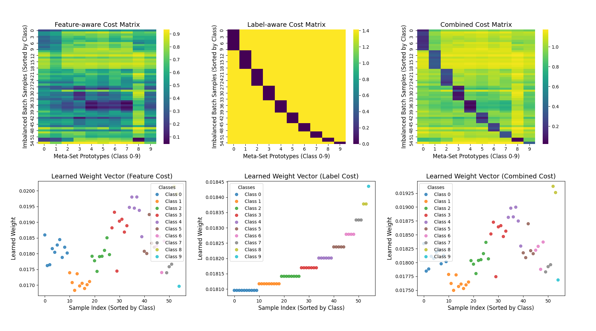

# Learning to Re-weight with Optimal Transport: A  Replication


This repository contains a PyTorch implementation and replication of the paper **"Learning to Re-weight Examples with Optimal Transport for Imbalanced Classification"** by Guo et al. (2022).

## Overview

This project tackles the long-tailed classification problem by implementing a two-stage training strategy that leverages Optimal Transport (OT). The core idea is to learn sample-specific weights by minimizing the OT distance between the imbalanced training distribution and a balanced meta-set distribution. This approach decouples weight learning from the classifier optimization, leading to more robust performance on imbalanced datasets.


## Results
Our replication validates the findings of the original paper, showing significant performance gains over standard training methods on imbalanced data.

### Quantitative Comparison
The table below compares the Top-1 test error (\%) of our implementation against the results reported in the original paper.

| Dataset        | IF  | Original Paper Error (\%) | Replicated Error (\%) |
| :------------- | :-: | :-----------------------: | :-------------------: |
| **CIFAR-10-LT**| 200 |           21.54           |         22.63         |
|                | 100 |           18.13           |         17.6        |
|                | 50  |           15.54           |         17.02         |
|                | 20  |           12.50           |         13.05        |
| **CIFAR-100-LT**| 200 |           54.97           |         56.42         |
|                | 100 |           51.46           |         55.46         |
|                | 50  |           47.50           |         47.91         |
|                | 20  |           42.85           |         42.63         |


### Qualitative Analysis
The visualization below, replicating Figure 1 from the paper, shows how different cost functions (feature-aware, label-aware, combined) affect the learned sample weights. The combined cost effectively balances class-level and instance-level importance.



---
## Reference

```bibtex
@article{guo2022learning,
  title={Learning to Re-weight Examples with Optimal Transport for Imbalanced Classification},
  author={Guo, Dandan and Li, Zhuo and Zheng, Meixi and Zhao, He and Zhou, Mingyuan and Zha, Hongyuan},
  journal={arXiv preprint arXiv:2208.02951},
  year={2022}
}
```

## License
This project is licensed under the MIT License.
